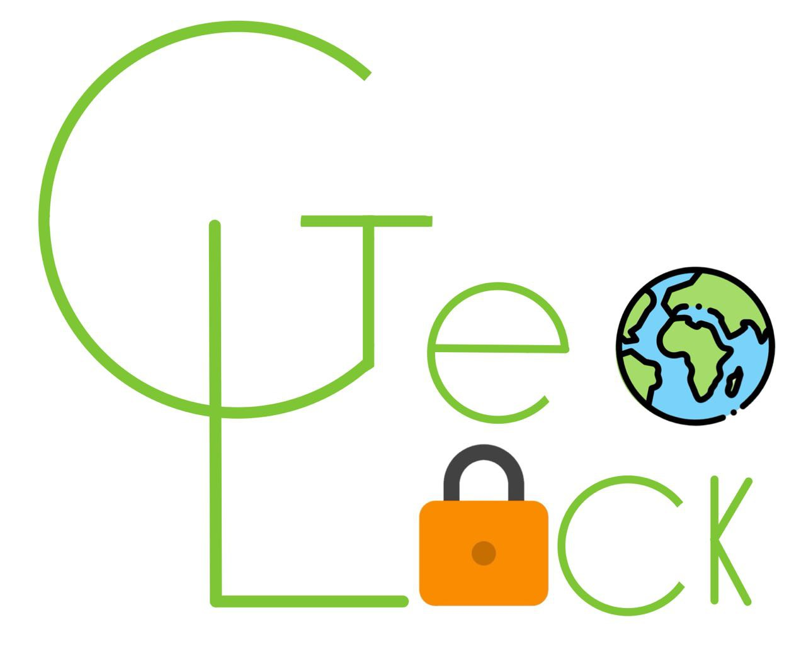

# GeoLock
**It is not necessary to run the backend locally since we configured the app to work with a remotely deployed backend.**

The Android app is in the *geolock* folder. Note that the following issues might occur when running the app in the emulator and not on a physical device:
- The map is not centered on the user's location on startup.
- Capturing an image using the camera while creating a spot is not possible because the emulator mistakenly assumes that no camera app is installed, even though one is available.

Therefore, we suggest running the app on a physical device.

The following libraries were used:
- [Subsampling Scale Image View](https://github.com/davemorrissey/subsampling-scale-image-view)
- [Retrofit](https://github.com/square/retrofit)
- [osmdroid](https://github.com/osmdroid/osmdroid)
- [Material Design](https://github.com/material-components/material-components-android)

This Android application was developed in the context of the Mobile and Wearable Computing course at Università della Svizzera italiana in the autumn semester 2024. 

    

